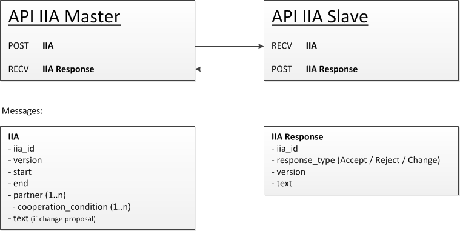

Interinstitutional Agreement (IIA) API
======================================

* [What is the status of this document?][statuses]
* [See the index of all other EWP Specifications][develhub]

Summary
-------

This document describes the **IIA API**. These are the APIs needed to exchange interinstitutional agreements between two
or more partners. There is need for APIs on both sides to be able to exchange this information.

Participants
------------

* **MASTER** - This will be the owner of the agreement. The institution that initiates the work on the agreement will be designated
  master. The master is responsible for merging any changes that the other partners propose to the document. This is to
  avoid the problem of different partners trying to over write each other's changes.
* **SLAVE** - The other partners in the agreement are called slaves. They cannot change the master document, only propose changes
  and accept or reject an agreement.

Basic flow
----------

The Master initiates the IIA and sends the IIA-XML to all partners (slaves). The slaves can then either approve, reject or propose
changes to the IIA. This will be relayed to the master, using an XML with both structured and unstructured data (XML with text). 
Examples to come later. It is the Master's responsibility to keep track of change requests and approvals. Every time the IIA is
changed by the master (based on the change requests), the version of the IIA is changed, so the other partners can see what state 
the document is in, and for the Master to know exactly what has been approved or rejected. There is some manual labour required by 
the Master, both in merging changes and keeping track of approvals.

Implementation
--------------

The IIA-API will contain functionality for both the Master and the Slave; if you implement the IIA-API you can be both Master 
and Slave in the network.

* **Master API** - Receive a Slave response (Approve, Reject, Change)
* **Slave API** - Receive a Master request (IIA XML)